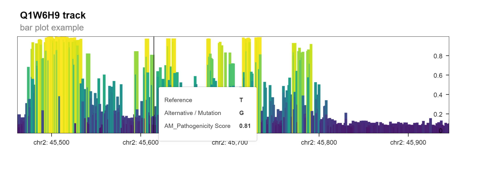
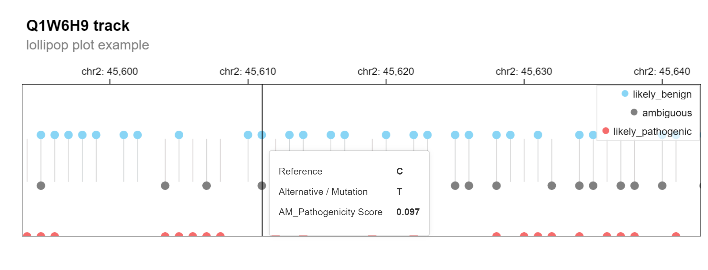

# B. AlphaFold Integration

Original version: 31 October, 2023

## Introduction

This vignette illustrates how to display
[AlphaMissense](https://www.science.org/doi/10.1126/science.adg7492)
predictions on [AlphaFold](https://alphafold.ebi.ac.uk/) predicted
protein structure.

Visualization makes use of CRAN packages
[bio3d](https://CRAN.R-project.org/package=bio3d) and
[r3dmol](https://CRAN.R-project.org/package=r3dmol). Install these (if
necessary) with

``` r
pkgs <- c("bio3d", "r3dmol")
pkgs_to_install <- pkgs[!pkgs %in% rownames(installed.packages())]
if (length(pkgs_to_install))
    BiocManager::install(pkgs_to_install)
```

Start by loading the
[AlphaMissenseR](https://mtmorgan.github.io/AlphaMissenseR) library.

``` r
library(AlphaMissenseR)
```

Visit the summary of available AlphaMissense datasets

``` r
am_available()
#> # A tibble: 7 × 6
#>   record   key                             size cached filename            link 
#>   <chr>    <chr>                          <dbl> <lgl>  <chr>               <chr>
#> 1 10813168 gene_hg38                     253636 TRUE   AlphaMissense_gene… http…
#> 2 10813168 isoforms_hg38             1177361934 FALSE  AlphaMissense_isof… http…
#> 3 10813168 isoforms_aa_substitutions 2461351945 FALSE  AlphaMissense_isof… http…
#> 4 10813168 hg38                       642961469 TRUE   AlphaMissense_hg38… http…
#> 5 10813168 hg19                       622293310 FALSE  AlphaMissense_hg19… http…
#> 6 10813168 gene_hg19                     243943 FALSE  AlphaMissense_gene… http…
#> 7 10813168 aa_substitutions          1207278510 TRUE   AlphaMissense_aa_s… http…
```

This vignette uses the `aa_substitutions` and `hg38` data resources;
make sure that these have been cached locally.

``` r
am_data("aa_substitutions")
#> # Source:   table<aa_substitutions> [?? x 4]
#> # Database: DuckDB 1.4.2 [mtmorgan@Darwin 25.1.0:R 4.6.0//Users/mtmorgan/Library/Caches/org.R-project.R/R/BiocFileCache/785c21cda4e0_785c21cda4e0]
#>    uniprot_id protein_variant am_pathogenicity am_class  
#>    <chr>      <chr>                      <dbl> <chr>     
#>  1 A0A024R1R8 M1A                        0.467 ambiguous 
#>  2 A0A024R1R8 M1C                        0.383 ambiguous 
#>  3 A0A024R1R8 M1D                        0.827 pathogenic
#>  4 A0A024R1R8 M1E                        0.524 ambiguous 
#>  5 A0A024R1R8 M1F                        0.275 benign    
#>  6 A0A024R1R8 M1G                        0.548 ambiguous 
#>  7 A0A024R1R8 M1H                        0.552 ambiguous 
#>  8 A0A024R1R8 M1I                        0.321 benign    
#>  9 A0A024R1R8 M1K                        0.288 benign    
#> 10 A0A024R1R8 M1L                        0.175 benign    
#> # ℹ more rows
am_data("hg38")
#> # Source:   table<hg38> [?? x 10]
#> # Database: DuckDB 1.4.2 [mtmorgan@Darwin 25.1.0:R 4.6.0//Users/mtmorgan/Library/Caches/org.R-project.R/R/BiocFileCache/785c21cda4e0_785c21cda4e0]
#>    CHROM   POS REF   ALT   genome uniprot_id transcript_id     protein_variant
#>    <chr> <dbl> <chr> <chr> <chr>  <chr>      <chr>             <chr>          
#>  1 chr1  69094 G     T     hg38   Q8NH21     ENST00000335137.4 V2L            
#>  2 chr1  69094 G     C     hg38   Q8NH21     ENST00000335137.4 V2L            
#>  3 chr1  69094 G     A     hg38   Q8NH21     ENST00000335137.4 V2M            
#>  4 chr1  69095 T     C     hg38   Q8NH21     ENST00000335137.4 V2A            
#>  5 chr1  69095 T     A     hg38   Q8NH21     ENST00000335137.4 V2E            
#>  6 chr1  69095 T     G     hg38   Q8NH21     ENST00000335137.4 V2G            
#>  7 chr1  69097 A     G     hg38   Q8NH21     ENST00000335137.4 T3A            
#>  8 chr1  69097 A     C     hg38   Q8NH21     ENST00000335137.4 T3P            
#>  9 chr1  69097 A     T     hg38   Q8NH21     ENST00000335137.4 T3S            
#> 10 chr1  69098 C     A     hg38   Q8NH21     ENST00000335137.4 T3N            
#> # ℹ more rows
#> # ℹ 2 more variables: am_pathogenicity <dbl>, am_class <chr>
```

## AlphaFold protein structure

AlphaMissense predictions on pathogenicity of amino acid changes can be
combined with AlphaFold (or other) predictions of protein structure.

### Fast path

Figure 3F of the
[AlphaMissense](https://www.science.org/doi/10.1126/science.adg7492)
publication visualizes mean pathogenicity for UniProt id P35557. Filter
amino acid data for that identifier

``` r
P35557_aa <-
    am_data("aa_substitutions") |>
    dplyr::filter(uniprot_id == "P35557")
```

and visualization median pathogenicity with

``` r
af_prediction_view(P35557_aa)
```

The image is interactive, including rotation and zoom. The following
sections explore this visualization in more detail.

### UniProt identifiers

Both AlphaMissense and AlphaFold use UniProt identifiers. Find all
AlphaMissense amino acid substitutions with UniProt identifiers starting
with `P3555`; the choice of this identifier is so that results can be
compared with Figure 3F of the
[AlphaMissense](https://www.science.org/doi/10.1126/science.adg7492)
publication.

``` r
uniprot_ids <-
    am_data("aa_substitutions") |>
    dplyr::filter(uniprot_id %like% "P3555%") |>
    dplyr::distinct(uniprot_id) |>
    pull(uniprot_id)
uniprot_ids
#> [1] "P35556" "P35555" "P35558" "P35557"
```

The [AlphaMissenseR](https://mtmorgan.github.io/AlphaMissenseR) package
includes several functions that facilitate interaction with
[AlphaFold](https://alphafold.ebi.ac.uk/); these functions start with
`af_*()`. Use
[`af_predictions()`](https://mtmorgan.github.io/AlphaMissenseR/reference/AlphaFold.md)
to discover AlphaFold predictions (via the AlphaFold API) associated
with UniProt identifiers.

``` r
prediction <- af_predictions(uniprot_ids)
#> * [14:46:35][info] 1 of 4 uniprot accessions not found
#>   'P35555'
glimpse(prediction)
#> Rows: 2
#> Columns: 39
#> $ toolUsed                   <chr> "AlphaFold Monomer v2.0 pipeline", "AlphaFo…
#> $ providerId                 <chr> "GDM", "GDM"
#> $ entityType                 <chr> "protein", "protein"
#> $ isUniProt                  <lgl> TRUE, TRUE
#> $ modelEntityId              <chr> "AF-P35558-F1", "AF-P35557-F1"
#> $ modelCreatedDate           <chr> "2025-08-01T00:00:00Z", "2025-08-01T00:00:0…
#> $ sequenceVersionDate        <chr> "2006-03-07T00:00:00Z", "1994-06-01T00:00:0…
#> $ globalMetricValue          <dbl> 96.44, 93.69
#> $ fractionPlddtVeryLow       <dbl> 0.003, 0.002
#> $ fractionPlddtLow           <dbl> 0.011, 0.019
#> $ fractionPlddtConfident     <dbl> 0.048, 0.133
#> $ fractionPlddtVeryHigh      <dbl> 0.937, 0.845
#> $ latestVersion              <int> 6, 6
#> $ allVersions                <list> [1, 2, 3, 4, 5, 6], [1, 2, 3, 4, 5, 6]
#> $ sequence                   <chr> "MPPQLQNGLNLSAKVVQGSLDSLPQAVREFLENNAELCQPDH…
#> $ sequenceStart              <int> 1, 1
#> $ sequenceEnd                <int> 622, 465
#> $ sequenceChecksum           <chr> "78D309E0845CC181", "094D4A2F78096724"
#> $ isUniProtReviewed          <lgl> TRUE, TRUE
#> $ gene                       <chr> "PCK1", "GCK"
#> $ uniprotAccession           <chr> "P35558", "P35557"
#> $ uniprotId                  <chr> "PCKGC_HUMAN", "HXK4_HUMAN"
#> $ uniprotDescription         <chr> "Phosphoenolpyruvate carboxykinase, cytosol…
#> $ taxId                      <int> 9606, 9606
#> $ organismScientificName     <chr> "Homo sapiens", "Homo sapiens"
#> $ isUniProtReferenceProteome <lgl> TRUE, TRUE
#> $ bcifUrl                    <chr> "https://alphafold.ebi.ac.uk/files/AF-P3555…
#> $ cifUrl                     <chr> "https://alphafold.ebi.ac.uk/files/AF-P3555…
#> $ pdbUrl                     <chr> "https://alphafold.ebi.ac.uk/files/AF-P3555…
#> $ paeImageUrl                <chr> "https://alphafold.ebi.ac.uk/files/AF-P3555…
#> $ msaUrl                     <chr> "https://alphafold.ebi.ac.uk/files/msa/AF-P…
#> $ plddtDocUrl                <chr> "https://alphafold.ebi.ac.uk/files/AF-P3555…
#> $ paeDocUrl                  <chr> "https://alphafold.ebi.ac.uk/files/AF-P3555…
#> $ entryId                    <chr> "AF-P35558-F1", "AF-P35557-F1"
#> $ uniprotSequence            <chr> "MPPQLQNGLNLSAKVVQGSLDSLPQAVREFLENNAELCQPDH…
#> $ uniprotStart               <int> 1, 1
#> $ uniprotEnd                 <int> 622, 465
#> $ isReferenceProteome        <lgl> TRUE, TRUE
#> $ isReviewed                 <lgl> TRUE, TRUE
```

Note the message indicating that some UniProt identifiers (accessions)
are not found in the AlphaFold database. The query returns a tibble
containing columns with information on organism and UniProt
characteristics (including protein sequence) , as well as URLs for files
representing three-dimensional protein structure. We will use `pdbUrl`.

### Protein structure

Focus on a particular UniProt identifier and the PDB url.

``` r
pdb_url <-
    prediction |>
    dplyr::filter(uniprotAccession == "P35557") |>
    dplyr::pull(pdbUrl)
```

Cache the PDB file using BiocFileCache, and read the PDB file using
[bio3d](https://CRAN.R-project.org/package=bio3d).

``` r
pdb_file <- BiocFileCache::bfcrpath(rnames = basename(pdb_url), fpath = pdb_url)
pdb <- bio3d::read.pdb(pdb_file)
pdb
#> 
#>  Call:  bio3d::read.pdb(file = pdb_file)
#> 
#>    Total Models#: 1
#>      Total Atoms#: 3642,  XYZs#: 10926  Chains#: 1  (values: A)
#> 
#>      Protein Atoms#: 3642  (residues/Calpha atoms#: 465)
#>      Nucleic acid Atoms#: 0  (residues/phosphate atoms#: 0)
#> 
#>      Non-protein/nucleic Atoms#: 0  (residues: 0)
#>      Non-protein/nucleic resid values: [ none ]
#> 
#>    Protein sequence:
#>       MLDDRARMEAAKKEKVEQILAEFQLQEEDLKKVMRRMQKEMDRGLRLETHEEASVKMLPT
#>       YVRSTPEGSEVGDFLSLDLGGTNFRVMLVKVGEGEEGQWSVKTKHQMYSIPEDAMTGTAE
#>       MLFDYISECISDFLDKHQMKHKKLPLGFTFSFPVRHEDIDKGILLNWTKGFKASGAEGNN
#>       VVGLLRDAIKRRGDFEMDVVAMVNDTVATMISCYYEDHQCEVGMI...<cut>...MLGQ
#> 
#> + attr: atom, xyz, seqres, calpha, call
```

Visualize the protein using
[r3dmol](https://CRAN.R-project.org/package=r3dmol), using the ‘cartoon’
style.

``` r
r3dmol::r3dmol() |>
    ## use the PDB representation
    r3dmol::m_add_model(r3dmol::m_bio3d(pdb)) |>
    ## visualize as a 'cartoon' with alpha helices and beta sheets
    r3dmol::m_set_style(style = r3dmol::m_style_cartoon(arrow = TRUE)) |>
    ## fit molecule into display area
    r3dmol::m_zoom_to()
```

### Average pathogenicity

Our goal is to visualize some measure of ‘average’ pathogenicity on the
three-dimensional protein structure provided by AlphaFold. Start with a
specific genome sequence (e.g., `hg38`). Filter to the amino acids in
our UniProt region of interest.

``` r
P35557 <-
    am_data("hg38") |>
    dplyr::filter(uniprot_id == "P35557")
```

At each chromosome position, the AlphaMissense predictions contain
several alternative alleles and hence protein variants. The (arithmetic)
average pathogenicity (this is an extremely naive computation) at each
amino acid position is

``` r
pathogenicity <- am_aa_pathogenicity(P35557)
pathogenicity
#> # A tibble: 464 × 9
#>    uniprot_id aa_pos aa_ref aa_pathogenicity_n aa_pathogenicity_mean
#>    <chr>       <int> <chr>               <int>                 <dbl>
#>  1 P35557          2 L                       5                0.0818
#>  2 P35557          3 D                       8                0.184 
#>  3 P35557          4 D                       8                0.147 
#>  4 P35557          5 R                       6                0.250 
#>  5 P35557          6 A                       6                0.138 
#>  6 P35557          7 R                       7                0.257 
#>  7 P35557          8 M                       9                0.142 
#>  8 P35557          9 E                       7                0.212 
#>  9 P35557         10 A                       6                0.142 
#> 10 P35557         11 A                       6                0.142 
#> # ℹ 454 more rows
#> # ℹ 4 more variables: aa_pathogenicity_median <dbl>,
#> #   aa_pathogenicity_min <dbl>, aa_pathogenicity_max <dbl>,
#> #   aa_pathogenicity_mode <fct>
```

### Coloring amino acids by position

Individual amino acids can be colored using the `colorfunc=` argument to
[`r3dmol::m_style_cartoon()`](https://rdrr.io/pkg/r3dmol/man/m_style_cartoon.html).
This is a Javascript function that takes each atom position and returns
the corresponding color. The approach taken in
[AlphaMissenseR](https://mtmorgan.github.io/AlphaMissenseR) is to use a
template, ultimately replacing `...` with a vector of residue colors.

``` r
cat(
    AlphaMissenseR:::js_template("colorfunc", colors = "..."),
    "\n"
)
#> function(atom) {
#>     const residue_colors = [ ... ];
#>     return residue_colors[atom.resi];
#> }
```

The function
[`af_colorfunc_by_position()`](https://mtmorgan.github.io/AlphaMissenseR/reference/AlphaFold.md)
provides a mechanism for translating a vector of scores between zero and
one into a vector of colors. This is illustrated for a 12-amino acid
sequence where the first and last residues are uncolored.

``` r
df <- tibble(
    pos = 1 + 1:10, # no color information for position 1
    value = 10:1 / 10
)
colorfunc <- af_colorfunc_by_position(
    df,
    "pos", "value",
    pos_max = 12    # no color information for position 12
)
cat(colorfunc, "\n")
#> function(atom) {
#>     const residue_colors = [ 'gray', '#8E063B', '#AB5468', '#C18692', '#D2B0B6', '#DDD0D2', '#D2D3DC', '#B3B7CF', '#8C94BF', '#5D6CAE', '#023FA5', 'gray' ];
#>     return residue_colors[atom.resi];
#> }
```

The following color function is similar to that used in
[`af_prediction_view()`](https://mtmorgan.github.io/AlphaMissenseR/reference/AlphaFold.md),
but uses the mean rather than median pathogenicity and scales the
palette between the minimum and maximum values of the mean pathogenicity
vector, rather than between 0 and 1.

``` r
colorfunc <-
    pathogenicity |>
    af_colorfunc_by_position(
        "aa_pos", "aa_pathogenicity_mean",
        length(pdb$seqres)
    )
```

Add this as the `colorfunc=` argument to `m_style_cartoon()` for
visualization.

``` r
r3dmol::r3dmol() |>
    ## use the PDB representation
    r3dmol::m_add_model(r3dmol::m_bio3d(pdb)) |>
    ## visualize as a 'cartoon' with alpha helices and beta sheets
    r3dmol::m_set_style(
        style = r3dmol::m_style_cartoon(
            arrow = TRUE,
            ## color residue according to colorfunc
            colorfunc = colorfunc
        )
    ) |>
    ## fit molecule into display area
    r3dmol::m_zoom_to()
```

## Visualizing genomic tracks

The variant effect prediction data can also be visualized in a genome
browser view. This allows the user to explore the predicted
pathogenicity of single nucleotide missense mutations in a gene of
interest. This multi-scale visualization is based on
[Gosling](https://gosling-lang.org/), a grammar-based toolkit for
scalable and interactive genomics data visualization.

For demonstration, we create a `GPos` object for a protein of interest.

``` r
gpos <-
    am_data("hg38") |>
    filter(uniprot_id == "Q1W6H9") |>
    to_GPos()
```

The function `plot_granges` invokes functionality from the
[shiny.gosling](https://bioconductor.org/packages/shiny.gosling) package
to produce an interactive genome track plot in which the pathogenicity
score for each point mutation in a linear genomic track.

The resulting plot is a [Shiny](https://shiny.posit.co/) app that can be
displayed when running the following command in an interactive R
session.

``` r
gosling_plot(
    gpos, plot_type = "bar",
    title = "Q1W6H9 track",
    subtitle = "bar plot example"
)
```



Bar plot for Q1W6H9

Alternatively, a multiscale-lollipop plot can be generated with the same
function by changing the `plot_type` argument to highlight the predicted
class outcomes for each mutation (ambigious, benign, pathogenic).

``` r
gosling_plot(
    gpos, plot_type = "lollipop",
    title = "Q1W6H9 track",
    subtitle = "lollipop plot example"
)
```



Lollipop plot for Q1W6H9

## Finally

Remember to disconnect and shutdown all managed DuckDB connections.

``` r
db_disconnect_all()
#> * [14:46:37][info] disconnecting all registered connections
```

Database connections that are not closed correctly trigger warning
messages.

## Session information

``` r
sessionInfo()
#> R Under development (unstable) (2025-08-09 r88545)
#> Platform: aarch64-apple-darwin24.6.0
#> Running under: macOS Tahoe 26.1
#> 
#> Matrix products: default
#> BLAS:   /Users/mtmorgan/bin/R-devel/lib/libRblas.dylib 
#> LAPACK: /Users/mtmorgan/bin/R-devel/lib/libRlapack.dylib;  LAPACK version 3.12.1
#> 
#> locale:
#> [1] en_CA.UTF-8/en_CA.UTF-8/en_CA.UTF-8/C/en_CA.UTF-8/en_CA.UTF-8
#> 
#> time zone: America/Toronto
#> tzcode source: internal
#> 
#> attached base packages:
#> [1] stats     graphics  grDevices utils     datasets  methods   base     
#> 
#> other attached packages:
#> [1] AlphaMissenseR_1.7.1 dplyr_1.1.4         
#> 
#> loaded via a namespace (and not attached):
#>  [1] gtable_0.3.6         xfun_0.54            bslib_0.9.0         
#>  [4] ggplot2_4.0.1        httr2_1.2.1          htmlwidgets_1.6.4   
#>  [7] vctrs_0.6.5          rjsoncons_1.3.2      tools_4.6.0         
#> [10] generics_0.1.4       stats4_4.6.0         curl_7.0.0          
#> [13] parallel_4.6.0       tibble_3.3.0         RSQLite_2.4.4       
#> [16] blob_1.2.4           shiny.gosling_1.5.0  pkgconfig_2.0.3     
#> [19] BiocBaseUtils_1.12.0 dbplyr_2.5.1         RColorBrewer_1.1-3  
#> [22] S4Vectors_0.48.0     S7_0.2.1             desc_1.4.3          
#> [25] RcppSpdlog_0.0.23    lifecycle_1.0.4      compiler_4.6.0      
#> [28] farver_2.1.2         textshaping_1.0.4    Seqinfo_1.0.0       
#> [31] GenomeInfoDb_1.46.0  httpuv_1.6.16        htmltools_0.5.8.1   
#> [34] sass_0.4.10          yaml_2.3.10          later_1.4.4         
#> [37] pillar_1.11.1        pkgdown_2.2.0        jquerylib_0.1.4     
#> [40] whisker_0.4.1        tidyr_1.3.1          cachem_1.1.0        
#> [43] mime_0.13            tidyselect_1.2.1     r3dmol_0.1.2        
#> [46] digest_0.6.39        duckdb_1.4.2         purrr_1.2.0         
#> [49] fastmap_1.2.0        grid_4.6.0           colorspace_2.1-2    
#> [52] cli_3.6.5            magrittr_2.0.4       dichromat_2.0-0.1   
#> [55] spdl_0.0.5           utf8_1.2.6           withr_3.0.2         
#> [58] UCSC.utils_1.6.0     promises_1.5.0       filelock_1.0.3      
#> [61] scales_1.4.0         rappdirs_0.3.3       bit64_4.6.0-1       
#> [64] XVector_0.50.0       rmarkdown_2.30       httr_1.4.7          
#> [67] otel_0.2.0           bit_4.6.0            ragg_1.5.0          
#> [70] shiny_1.11.1         memoise_2.0.1        evaluate_1.0.5      
#> [73] knitr_1.50           IRanges_2.44.0       GenomicRanges_1.62.0
#> [76] bio3d_2.4-5          BiocFileCache_3.0.0  rlang_1.1.6         
#> [79] Rcpp_1.1.0           xtable_1.8-4         glue_1.8.0          
#> [82] DBI_1.2.3            BiocGenerics_0.56.0  jsonlite_2.0.0      
#> [85] R6_2.6.1             systemfonts_1.3.1    fs_1.6.6
```
