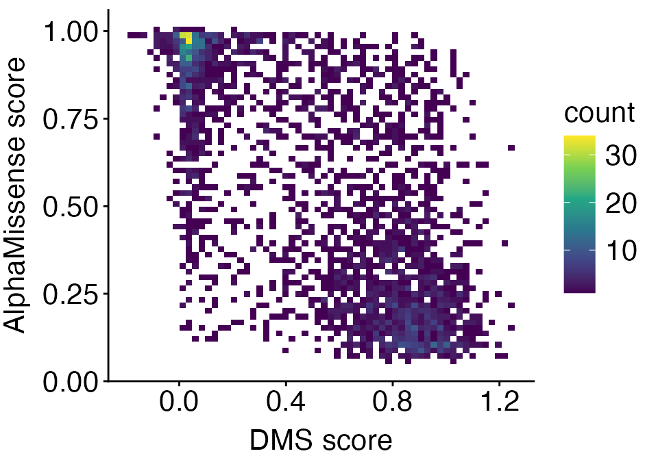
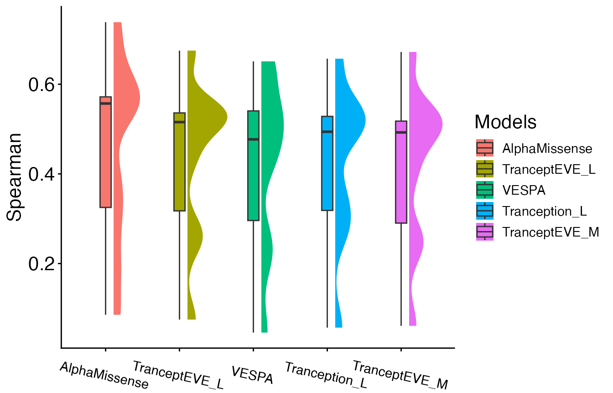

# D. Benchmarking with ProteinGym

Original version: 8 October, 2024

``` r
library(AlphaMissenseR)
library(ExperimentHub)
library(dplyr)
library(tidyr)
library(ggdist)
library(ggplot2)
```

## Introduction

Benchmarking is essential for assessing different variant effect
prediction approaches, potentially aiding in decisions about which
models are most suitable for specific research questions or clinical
applications.

To evaluate the performance of AlphaMissense and its predictions, we
integrate with the [ProteinGym](https://proteingym.org/) database, a
comprehensive collection of benchmarks aimed at comparing the ability of
models that predict the effects of protein mutations. It consists of an
extensive dataset of deep mutational scanning (DMS) assays covering
approximately 2.7 million missense variants across 217 experiments, as
well as annotated human clinical variants for 2,525 proteins. DMS assays
are highly valuable as they systematically test all possible single
mutations in a protein, recording their fitness effects. They can reveal
the impacts of both deleterious and beneficial mutations on fitness,
offering insights into protein structure and activity.

Furthermore, ProteinGym provides several standardized model evaluation
metric scores (“AUC”, “MCC”, “NDCG”, “Spearman”, “Top_recall”) for 62
models calculated across the 217 DMS assays, offering a consistent and
extensive benchmarking framework across approaches.

This vignette demonstrates how to 1) compare AlphaMissense predictions
to DMS scores on a per-protein basis, and 2) how to benchmark
AlphaMissense against other models aimed at predicting protein mutation
effects.

## Access ProteinGym datasets through `ExperimentHub`.

The ProteinGym DMS assays can be accessed by querying `ExperimentHub`.

``` r
eh <- ExperimentHub::ExperimentHub()
dms_data <- eh[['EH9555']]
#> see ?ProteinGymR and browseVignettes('ProteinGymR') for documentation
#> loading from cache

head(names(dms_data))
#> [1] "A0A140D2T1_ZIKV_Sourisseau_2019"  "A0A192B1T2_9HIV1_Haddox_2018"    
#> [3] "A0A1I9GEU1_NEIME_Kennouche_2019"  "A0A247D711_LISMN_Stadelmann_2021"
#> [5] "A0A2Z5U3Z0_9INFA_Doud_2016"       "A0A2Z5U3Z0_9INFA_Wu_2014"
```

Each element of the list is an individual DMS assay with the following
information for each column: the UniProt protein identifier, the DMS
experiment assay identifier, the mutant at a given protein position, the
mutated protein sequence, the recorded DMS score, and a binary DMS score
bin categorizing whether the mutation has high (1) or low fitness (0).
For more details, reference the publication from Notin et
al. [2023](https://papers.nips.cc/paper_files/paper/2023/hash/cac723e5ff29f65e3fcbb0739ae91bee-Abstract-Datasets_and_Benchmarks.html).

A supplementary table of AlphaMissense pathogencity scores for ~1.6 M
substitutions matching those in the ProteinGym DMS assays is provided by
Cheng et
al. [2023](https://www.science.org/doi/10.1126/science.adg7492), and can
also be accessed through `ExperimentHub`.

``` r
am_scores <- eh[['EH9554']]
#> see ?ProteinGymR and browseVignettes('ProteinGymR') for documentation
#> loading from cache
am_scores |> head()
#>                                   DMS_id      Uniprot_ID variant_id
#> 1 A0A140D2T1_ZIKV_Sourisseau_growth_2019 A0A140D2T1_ZIKV      I291A
#> 2 A0A140D2T1_ZIKV_Sourisseau_growth_2019 A0A140D2T1_ZIKV      I291Y
#> 3 A0A140D2T1_ZIKV_Sourisseau_growth_2019 A0A140D2T1_ZIKV      I291W
#> 4 A0A140D2T1_ZIKV_Sourisseau_growth_2019 A0A140D2T1_ZIKV      I291V
#> 5 A0A140D2T1_ZIKV_Sourisseau_growth_2019 A0A140D2T1_ZIKV      I291T
#> 6 A0A140D2T1_ZIKV_Sourisseau_growth_2019 A0A140D2T1_ZIKV      I291S
#>   AlphaMissense
#> 1     0.9124037
#> 2     0.8899629
#> 3     0.9694002
#> 4     0.2470229
#> 5     0.8939576
#> 6     0.8617630
```

The `data.frame` shows the `DMS_id` matching a ProteinGym assay, the
UniProt entry name of the protein evaluated, the mutation and position,
and the aggregated AlphaMissense score for that mutation. For more
details about the table, reference the
[AlphaMissense](https://www.science.org/doi/10.1126/science.adg7492)
paper.

## Correlate DMS scores and AlphaMissense predictions

The DMS scores serve as an experimental measure to compare the accuracy
of AlphaMissense mutation effect predictions. For a given protein, we
can plot the relationship between the two measures and report their
Spearman correlation.

Here, we demonstrate using the “NUD15_HUMAN” assay. First, we filter
both datasets to the chosen assay.

``` r
NUD15_dms <- dms_data[["NUD15_HUMAN_Suiter_2020"]]

NUD15_am <- am_scores |> 
    filter(DMS_id == "NUD15_HUMAN_Suiter_2020")
```

Wrangle and merge the DMS and AlphaMissense tables together by the
UniProt and mutant identifers.

``` r
NUD15_am <- NUD15_am |>
    mutate(Uniprot_ID = "Q9NV35")

merged_table <- 
    left_join(
        NUD15_am, NUD15_dms, 
        by = c("Uniprot_ID" = "UniProt_id", "variant_id" = "mutant"),
        relationship = "many-to-many"
    ) |>
    select(Uniprot_ID, variant_id, AlphaMissense, DMS_score) |> 
    na.omit()
```

Now, we plot the correlation.

``` r
correlation_plot <- 
    merged_table |> 
    ggplot(
        aes(y = .data$AlphaMissense, x = .data$DMS_score)
    ) +
    geom_bin2d(bins = 60) +
    scale_fill_continuous(type = "viridis") +
    xlab("DMS score") +
    ylab("AlphaMissense score") +
    theme_classic() +
    theme(
        axis.text.x = element_text(size = 16),
        axis.text.y = element_text(size = 16),
        axis.title.y = element_text(size = 16, vjust = 2),
        axis.title.x = element_text(size = 16, vjust = 0),
        legend.title = element_text(size = 16),
        legend.text = element_text(size = 16)
    )

correlation_plot
```



If mutating a residue resulted in reduced fitness in the DMS assay (low
DMS score), we would expect it to be predicted as pathogenic (higher
AlphaMissense score). Therefore, a stronger negative correlation
represents a tighter relationship between the two measures. We can see
this with the NUD15 protein.

We can also print the Spearman correlation.

``` r
cor.test(
    merged_table$AlphaMissense, merged_table$DMS_score, 
    method="spearman", 
    exact = FALSE
)
#> 
#>  Spearman's rank correlation rho
#> 
#> data:  merged_table$AlphaMissense and merged_table$DMS_score
#> S = 6440239302, p-value < 2.2e-16
#> alternative hypothesis: true rho is not equal to 0
#> sample estimates:
#>        rho 
#> -0.6798269
```

The correlation is r = -0.67 and is statistically significant.

## Benchmark AlphaMissense with other variant effect prediction models

We can calculate the Spearman correlation across multiple DMS assays in
which we have corresponding AlphaMissense scores, and use this metric to
benchmark across multiple models aimed at predicting mutation effects.
For this analysis, we will load in the metric scores for 62 models
calculated across the 217 DMS assays from the ProteinGym database
available through `ExperimentHub`.

``` r
metrics_scores <- eh[['EH9593']]
#> see ?ProteinGymR and browseVignettes('ProteinGymR') for documentation
#> loading from cache
```

`metrics_scores` is a `list` object where each element is a `data.frame`
corresponding to one of five model evaluation metrics (“AUC”, “MCC”,
“NDCG”, “Spearman”, “Top_recall”) available from ProteinGym. Briefly,
these metrics were calculated on the DMS assays for 62 models in a
zero-shot setting. The [Protein Gym
paper](https://papers.nips.cc/paper_files/paper/2023/hash/cac723e5ff29f65e3fcbb0739ae91bee-Abstract-Datasets_and_Benchmarks.html)
provides more information about these metrics.

To demonstrate, we will benchmarking using the Spearman correlation
calculated on 10 DMS assays for 5 models. The following code subsets and
merges the relevant datasets.

``` r
chosen_assays <- c(
    "A0A1I9GEU1_NEIME_Kennouche_2019", 
    "A0A192B1T2_9HIV1_Haddox_2018", 
    "ADRB2_HUMAN_Jones_2020", 
    "BRCA1_HUMAN_Findlay_2018", 
    "CALM1_HUMAN_Weile_2017",
    "GAL4_YEAST_Kitzman_2015", 
    "Q59976_STRSQ_Romero_2015", 
    "UBC9_HUMAN_Weile_2017", 
    "TPK1_HUMAN_Weile_2017",
    "YAP1_HUMAN_Araya_2012")

am_subset <- 
    am_scores |> 
    filter(DMS_id %in% chosen_assays)

dms_subset <- 
    dms_data[names(dms_data) %in% chosen_assays]

dms_subset <- 
    bind_rows(dms_subset) |> 
    as.data.frame()

metric_subset <- 
    metrics_scores[["Spearman"]] |> 
    filter(DMS_ID %in% chosen_assays) |> 
    select(-c(Number_of_Mutants, Selection_Type, UniProt_ID, 
        MSA_Neff_L_category, Taxon))

merge_am_dms <-
    left_join(
        am_subset, dms_subset, 
        by = c("DMS_id" = "DMS_id", "variant_id" = "mutant"),
        relationship = "many-to-many"
    ) |>
    na.omit()
```

The Spearman scores are already provided for the 62 models in the
ProteinGym metrics table, but we will need to calculate this for
AlphaMissense.

``` r
spearman_res <- 
    merge_am_dms |> 
    group_by(DMS_id) |> 
    summarize(
        AlphaMissense = cor(AlphaMissense, DMS_score, method = "spearman")
    ) |> 
    mutate(
        AlphaMissense = abs(AlphaMissense)
    )

DMS_IDs <- metric_subset |> pull(DMS_ID)

metric_subset <- 
    metric_subset |> 
    select(-DMS_ID) |> 
    abs() |> 
    mutate(DMS_id = DMS_IDs)

all_sp <- 
    left_join(
        metric_subset, spearman_res, 
        by = "DMS_id"
    )
```

`all_sp` is a table of Spearman correlation values (absolute values to
handle difference in directionality of certain DMS assays) across the
ProteinGym and AlphaMissense models for the 10 assays.

Prepare the data for plotting.

``` r
res_long <- 
    all_sp |> 
    select(-DMS_id) |> 
    tidyr::pivot_longer(
        cols = everything(), 
        names_to = "model", 
        values_to = "score"
    ) |> 
    group_by(model) |> 
    mutate(
        model_mean = mean(score)
    ) |> 
    mutate(
        model = as.factor(model)
    ) |> 
    ungroup() 

unique_ordered_models <- unique(res_long$model[order(res_long$model_mean, 
                                                        decreasing = TRUE)])

res_long$model <- factor(res_long$model, 
                   levels = unique_ordered_models)

topmodels <- levels(res_long$model)[1:5]

top_spearmans <- 
    res_long |> 
    filter(model %in% topmodels) |> 
    droplevels()
```

Visualize with a raincloud plot.

``` r
top_spearmans |> 
    ggplot(
        aes(x = model, y = score, fill = model, group = model)
    ) + 
    ggdist::stat_halfeye(
        adjust = .5, 
        width = .6, 
        .width = 0, 
        justification = -.2, 
        point_colour = NA
    ) + 
    geom_boxplot(
        width = .15, 
        outlier.shape = NA
    ) +
    coord_cartesian(clip = "off") +
    scale_fill_discrete(name = "Models") +
    theme_classic() +
    ylab("Spearman") +
    theme(
        axis.text.x = element_text(size = 11, angle = -12),
        axis.text.y = element_text(size = 16),
        axis.title.y = element_text(size = 16),
        axis.title.x = element_blank(),
        legend.title = element_text(size = 16),
        legend.text = element_text(size = 11)
    )
```



Based on the Spearman correlation for the 10 assays we chose,
AlphaMissense performed the best. For a realistic and comprehensive
benchmark, one would want to apply this framework across all 217 DMS
assays available in ProteinGym.

## Session information

``` r
sessionInfo()
#> R Under development (unstable) (2025-08-09 r88545)
#> Platform: aarch64-apple-darwin24.6.0
#> Running under: macOS Tahoe 26.1
#> 
#> Matrix products: default
#> BLAS:   /Users/mtmorgan/bin/R-devel/lib/libRblas.dylib 
#> LAPACK: /Users/mtmorgan/bin/R-devel/lib/libRlapack.dylib;  LAPACK version 3.12.1
#> 
#> locale:
#> [1] en_CA.UTF-8/en_CA.UTF-8/en_CA.UTF-8/C/en_CA.UTF-8/en_CA.UTF-8
#> 
#> time zone: America/Toronto
#> tzcode source: internal
#> 
#> attached base packages:
#> [1] stats     graphics  grDevices utils     datasets  methods   base     
#> 
#> other attached packages:
#>  [1] ProteinGymR_1.4.0    ggplot2_4.0.1        ggdist_3.3.3        
#>  [4] tidyr_1.3.1          ExperimentHub_3.0.0  AnnotationHub_4.0.0 
#>  [7] BiocFileCache_3.0.0  dbplyr_2.5.1         BiocGenerics_0.56.0 
#> [10] generics_0.1.4       AlphaMissenseR_1.7.1 dplyr_1.1.4         
#> 
#> loaded via a namespace (and not attached):
#>  [1] KEGGREST_1.50.0      gtable_0.3.6         xfun_0.54           
#>  [4] bslib_0.9.0          httr2_1.2.1          htmlwidgets_1.6.4   
#>  [7] Biobase_2.70.0       vctrs_0.6.5          rjsoncons_1.3.2     
#> [10] tools_4.6.0          stats4_4.6.0         curl_7.0.0          
#> [13] tibble_3.3.0         AnnotationDbi_1.72.0 RSQLite_2.4.4       
#> [16] blob_1.2.4           pkgconfig_2.0.3      BiocBaseUtils_1.12.0
#> [19] RColorBrewer_1.1-3   S7_0.2.1             desc_1.4.3          
#> [22] S4Vectors_0.48.0     RcppSpdlog_0.0.23    distributional_0.5.0
#> [25] lifecycle_1.0.4      stringr_1.6.0        compiler_4.6.0      
#> [28] farver_2.1.2         Biostrings_2.78.0    textshaping_1.0.4   
#> [31] Seqinfo_1.0.0        htmltools_0.5.8.1    sass_0.4.10         
#> [34] queryup_1.0.5        yaml_2.3.10          crayon_1.5.3        
#> [37] pillar_1.11.1        pkgdown_2.2.0        jquerylib_0.1.4     
#> [40] whisker_0.4.1        cachem_1.1.0         tidyselect_1.2.1    
#> [43] digest_0.6.39        stringi_1.8.7        purrr_1.2.0         
#> [46] duckdb_1.4.2         BiocVersion_3.22.0   labeling_0.4.3      
#> [49] fastmap_1.2.0        grid_4.6.0           cli_3.6.5           
#> [52] magrittr_2.0.4       dichromat_2.0-0.1    spdl_0.0.5          
#> [55] withr_3.0.2          filelock_1.0.3       scales_1.4.0        
#> [58] rappdirs_0.3.3       bit64_4.6.0-1        XVector_0.50.0      
#> [61] httr_1.4.7           rmarkdown_2.30       bit_4.6.0           
#> [64] png_0.1-8            ragg_1.5.0           memoise_2.0.1       
#> [67] evaluate_1.0.5       knitr_1.50           IRanges_2.44.0      
#> [70] viridisLite_0.4.2    rlang_1.1.6          Rcpp_1.1.0          
#> [73] glue_1.8.0           DBI_1.2.3            BiocManager_1.30.27 
#> [76] jsonlite_2.0.0       R6_2.6.1             systemfonts_1.3.1   
#> [79] fs_1.6.6
```
