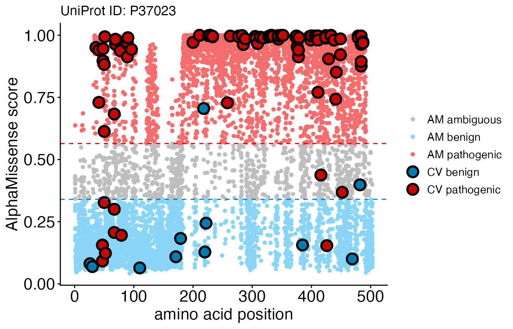

# C. ClinVar Integration

Original version: 1 May, 2024

``` r
library(AlphaMissenseR)
```

## Introduction

[ClinVar](https://www.ncbi.nlm.nih.gov/clinvar/) is a freely available,
public archive of human genetic variants that provides clinical
classifications for whether a variant is likely benign or pathogenic.
The AlphaMissense
[publication](https://www.science.org/doi/epdf/10.1126/science.adg7492)
uses the ClinVar data to evaluate and calibrate the predictions
generated by their model. A table containing ClinVar information for
82872 variants across 7951 proteins was derived from the supplemental
data of the AlphaMissense paper, and is made available through this
package for benchmarking and visualization purposes.

## Access ClinVar classifications with AlphaMissense predictions

The ClinVar table can be accessed using
[`clinvar_data()`](https://mtmorgan.github.io/AlphaMissenseR/reference/ClinVar.md)
from the database.

``` r
clinvar_data()
#> # Source:   table<clinvar> [?? x 5]
#> # Database: DuckDB 1.4.2 [mtmorgan@Darwin 25.1.0:R 4.6.0//Users/mtmorgan/Library/Caches/org.R-project.R/R/BiocFileCache/785c21cda4e0_785c21cda4e0]
#>    variant_id           transcript_id     protein_variant AlphaMissense label 
#>    <chr>                <chr>             <chr>                   <dbl> <fct> 
#>  1 chr1_925969_C_T_hg38 ENST00000342066.8 Q96NU1:P10S            0.967  benign
#>  2 chr1_930165_G_A_hg38 ENST00000342066.8 Q96NU1:R28Q            0.663  benign
#>  3 chr1_930204_G_A_hg38 ENST00000342066.8 Q96NU1:R41Q            0.0866 benign
#>  4 chr1_930245_G_A_hg38 ENST00000342066.8 Q96NU1:D55N            0.134  benign
#>  5 chr1_930248_G_A_hg38 ENST00000342066.8 Q96NU1:G56S            0.100  benign
#>  6 chr1_930282_G_A_hg38 ENST00000342066.8 Q96NU1:R67Q            0.0635 benign
#>  7 chr1_930285_G_A_hg38 ENST00000342066.8 Q96NU1:R68Q            0.0629 benign
#>  8 chr1_930314_C_T_hg38 ENST00000342066.8 Q96NU1:H78Y            0.110  benign
#>  9 chr1_930320_C_T_hg38 ENST00000342066.8 Q96NU1:R80C            0.0918 benign
#> 10 chr1_931058_G_A_hg38 ENST00000342066.8 Q96NU1:V92M            0.196  benign
#> # ℹ more rows
```

The ClinVar table is now available for exploration or parsing.

## Compare ClinVar and AlphaMissense

This section uses the
[`clinvar_plot()`](https://mtmorgan.github.io/AlphaMissenseR/reference/ClinVar.md)
function to generate a scatterplot for benchmarking and comparing
ClinVar classification with AlphaMissense predictions. By default, the
function takes one UniProt accession identifier, derives AlphaMissense
scores from `am_data("aa_substitution")`, and pulls ClinVar
classifications from the data.frame previously obtained. Alternatively,
it is possible to pass a custom AlphaMissense or ClinVar table to the
function. See function details for more information.

``` r
clinvar_plot(uniprotId = "P37023")
#> * [14:47:00][info] 'alphamissense_table' not provided, using default 'am_data("aa_substitution")' table accessed through the AlphaMissenseR package
#> * [14:47:24][info] 'clinvar_table' not provided, using default ClinVar dataset in AlphaMissenseR package
```



We returned a `ggplot` object which overlays ClinVar classifications
onto AlphaMissense predicted scores. Blue, gray, and red colors
represent pathogenicity classifications for “likely benign”,
“ambiguous”, or “likely pathogenic”, respectively. Large, bolded points
are ClinVar variants colored according to their clinical classification,
while smaller points in the background are AlphaMissense predictions.

We can note a discrepancy between the clinically-validated annotations
and the AlphaMissense predictions around position 50. AlphaMissense
seems to predict several variants in that region as likely benign, while
ClinVar identifies them as pathogenic.

Because the ClinVar dataset is not exhaustive (not all proteins have
been clinically-assessed), there may be proteins where information is
not available. In this case, the function will provide an error.

Remember to disconnect from the database.

``` r
db_disconnect_all()
#> * [14:47:24][info] disconnecting all registered connections
```

## Session information

``` r
sessionInfo()
#> R Under development (unstable) (2025-08-09 r88545)
#> Platform: aarch64-apple-darwin24.6.0
#> Running under: macOS Tahoe 26.1
#> 
#> Matrix products: default
#> BLAS:   /Users/mtmorgan/bin/R-devel/lib/libRblas.dylib 
#> LAPACK: /Users/mtmorgan/bin/R-devel/lib/libRlapack.dylib;  LAPACK version 3.12.1
#> 
#> locale:
#> [1] en_CA.UTF-8/en_CA.UTF-8/en_CA.UTF-8/C/en_CA.UTF-8/en_CA.UTF-8
#> 
#> time zone: America/Toronto
#> tzcode source: internal
#> 
#> attached base packages:
#> [1] stats     graphics  grDevices utils     datasets  methods   base     
#> 
#> other attached packages:
#> [1] AlphaMissenseR_1.7.1 dplyr_1.1.4         
#> 
#> loaded via a namespace (and not attached):
#>  [1] tidyr_1.3.1          utf8_1.2.6           rappdirs_0.3.3      
#>  [4] sass_0.4.10          generics_0.1.4       spdl_0.0.5          
#>  [7] RSQLite_2.4.4        digest_0.6.39        magrittr_2.0.4      
#> [10] RColorBrewer_1.1-3   evaluate_1.0.5       grid_4.6.0          
#> [13] fastmap_1.2.0        blob_1.2.4           jsonlite_2.0.0      
#> [16] whisker_0.4.1        DBI_1.2.3            purrr_1.2.0         
#> [19] scales_1.4.0         httr2_1.2.1          textshaping_1.0.4   
#> [22] jquerylib_0.1.4      duckdb_1.4.2         cli_3.6.5           
#> [25] rlang_1.1.6          dbplyr_2.5.1         bit64_4.6.0-1       
#> [28] withr_3.0.2          cachem_1.1.0         yaml_2.3.10         
#> [31] BiocBaseUtils_1.12.0 tools_4.6.0          memoise_2.0.1       
#> [34] ggplot2_4.0.1        filelock_1.0.3       curl_7.0.0          
#> [37] rjsoncons_1.3.2      vctrs_0.6.5          R6_2.6.1            
#> [40] BiocFileCache_3.0.0  lifecycle_1.0.4      RcppSpdlog_0.0.23   
#> [43] fs_1.6.6             htmlwidgets_1.6.4    bit_4.6.0           
#> [46] ragg_1.5.0           pkgconfig_2.0.3      desc_1.4.3          
#> [49] pkgdown_2.2.0        pillar_1.11.1        bslib_0.9.0         
#> [52] gtable_0.3.6         Rcpp_1.1.0           glue_1.8.0          
#> [55] systemfonts_1.3.1    xfun_0.54            tibble_3.3.0        
#> [58] tidyselect_1.2.1     dichromat_2.0-0.1    knitr_1.50          
#> [61] farver_2.1.2         htmltools_0.5.8.1    labeling_0.4.3      
#> [64] rmarkdown_2.30       compiler_4.6.0       S7_0.2.1
```
