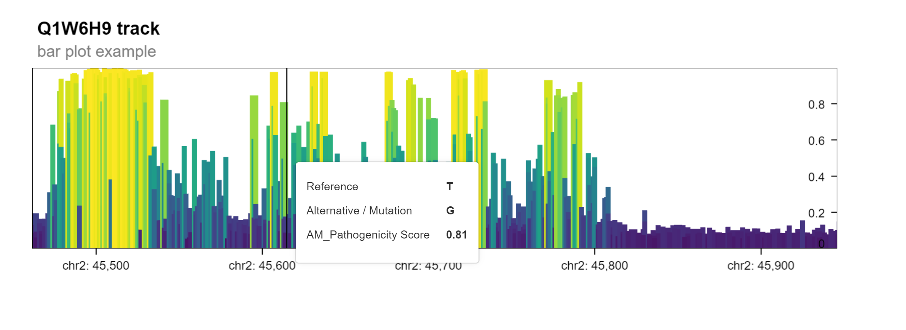

```{r, include = FALSE}
knitr::opts_chunk$set(
    collapse = TRUE,
    comment = "#>"
)
```

Original version: 31 October, 2023

# Introduction

This vignette illustrates how to display [AlphaMissense][] predictions
on [AlphaFold][] predicted protein structure.

[AlphaMissense]: https://www.science.org/doi/10.1126/science.adg7492
[AlphaFold]: https://alphafold.ebi.ac.uk/

Visualization makes use of CRAN packages [bio3d][] and
[r3dmol][]. Install these (if necessary) with

[bio3d]: https://CRAN.R-project.org/package=bio3d
[r3dmol]: https://CRAN.R-project.org/package=r3dmol

```{r dependencies, eval = FALSE}
pkgs <- c("bio3d", "r3dmol")
pkgs_to_install <- pkgs[!pkgs %in% rownames(installed.packages())]
if (length(pkgs_to_install))
    BiocManager::install(pkgs_to_install)
```

Start by loading the [AlphaMissenseR][] library.

[AlphaMissenseR]: https://mtmorgan.github.io/AlphaMissenseR

```{r setup, message = FALSE}
library(AlphaMissenseR)
```

Visit the summary of available AlphaMissense datasets

```{r am_available}
am_available()
```

This vignette uses the `aa_substitutions` and `hg38` data resources;
make sure that these have been cached locally.

```{r am_data}
am_data("aa_substitutions")
am_data("hg38")
```

# AlphaFold protein structure

AlphaMissense predictions on pathogenicity of amino acid changes can
be combined with AlphaFold (or other) predictions of protein
structure.

## Fast path

Figure 3F of the [AlphaMissense][] publication visualizes mean
pathogenicity for UniProt id P35557. Filter amino acid data for that
identifier

```{r P35557}
P35557_aa <-
    am_data("aa_substitutions") |>
    dplyr::filter(uniprot_id == "P35557")
```

and visualization median pathogenicity with

```{r median-pathogenicity}
af_prediction_view(P35557_aa)
```

The image is interactive, including rotation and zoom. The following
sections explore this visualization in more detail.

## UniProt identifiers

Both AlphaMissense and AlphaFold use UniProt
identifiers. Find all AlphaMissense amino acid substitutions with
UniProt identifiers starting with `P3555`; the choice of this
identifier is so that results can be compared with Figure 3F of the
[AlphaMissense][] publication.

```{r uniprot_ids}
uniprot_ids <-
    am_data("aa_substitutions") |>
    dplyr::filter(uniprot_id %like% "P3555%") |>
    dplyr::distinct(uniprot_id) |>
    pull(uniprot_id)
uniprot_ids
```

The [AlphaMissenseR][] package includes several functions that
facilitate interaction with [AlphaFold][]; these functions start with
`af_*()`. Use `af_predictions()` to discover AlphaFold predictions
(via the AlphaFold API) associated with UniProt identifiers.

```{r af_predictions}
prediction <- af_predictions(uniprot_ids)
glimpse(prediction)
```

Note the message indicating that some UniProt identifiers (accessions)
are not found in the AlphaFold database. The query returns a tibble
containing columns with information on organism and UniProt
characteristics (including protein sequence) , as well as URLs for
files representing three-dimensional protein structure. We will use
`pdbUrl`.

## Protein structure

Focus on a particular UniProt identifier and the PDB url.

```{r pdb_url}
pdb_url <-
    prediction |>
    dplyr::filter(uniprotAccession == "P35557") |>
    dplyr::pull(pdbUrl)
```

Cache the PDB file using BiocFileCache, and read the PDB file using
[bio3d][].

```{r pdb}
pdb_file <- BiocFileCache::bfcrpath(rnames = basename(pdb_url), fpath = pdb_url)
pdb <- bio3d::read.pdb(pdb_file)
pdb
```

Visualize the protein using [r3dmol][], using the 'cartoon' style.

```{r pdb_r3dmol}
r3dmol::r3dmol() |>
    ## use the PDB representation
    r3dmol::m_add_model(r3dmol::m_bio3d(pdb)) |>
    ## visualize as a 'cartoon' with alpha helices and beta sheets
    r3dmol::m_set_style(style = r3dmol::m_style_cartoon(arrow = TRUE)) |>
    ## fit molecule into display area
    r3dmol::m_zoom_to()
```

## Average pathogenicity

Our goal is to visualize some measure of 'average' pathogenicity on
the three-dimensional protein structure provided by AlphaFold.  Start
with a specific genome sequence (e.g., `hg38`). Filter to the amino
acids in our UniProt region of interest.

```{r am_data-hg38}
P35557 <-
    am_data("hg38") |>
    dplyr::filter(uniprot_id == "P35557")
```

At each chromosome position, the AlphaMissense predictions contain
several alternative alleles and hence protein variants. The
(arithmetic) average pathogenicity (this is an extremely naive
computation) at each amino acid position is

```{r am_aa_pathogenicity}
pathogenicity <- am_aa_pathogenicity(P35557)
pathogenicity
```

## Coloring amino acids by position

Individual amino acids can be colored using the `colorfunc=` argument
to `r3dmol::m_style_cartoon()`. This is a Javascript function that
takes each atom position and returns the corresponding color. The
approach taken in [AlphaMissenseR][] is to use a template, ultimately
replacing `...` with a vector of residue colors.

```{r js_template}
cat(
    AlphaMissenseR:::js_template("colorfunc", colors = "..."),
    "\n"
)
```

The function `af_colorfunc_by_position()` provides a mechanism for
translating a vector of scores between zero and one into a vector of
colors. This is illustrated for a 12-amino acid sequence where the
first and last residues are uncolored.

```{r af_colorfunc_by_position}
df <- tibble(
    pos = 1 + 1:10, # no color information for position 1
    value = 10:1 / 10
)
colorfunc <- af_colorfunc_by_position(
    df,
    "pos", "value",
    pos_max = 12    # no color information for position 12
)
cat(colorfunc, "\n")
```

The following color function is similar to that used in
`af_prediction_view()`, but uses the mean rather than median
pathogenicity and scales the palette between the minimum and maximum
values of the mean pathogenicity vector, rather than between 0 and 1.

```{r colorfunc}
colorfunc <-
    pathogenicity |>
    af_colorfunc_by_position(
        "aa_pos", "aa_pathogenicity_mean",
        length(pdb$seqres)
    )
```

Add this as the `colorfunc=` argument to `m_style_cartoon()` for
visualization.

```{r pdb_r3dmol_color}
r3dmol::r3dmol() |>
    ## use the PDB representation
    r3dmol::m_add_model(r3dmol::m_bio3d(pdb)) |>
    ## visualize as a 'cartoon' with alpha helices and beta sheets
    r3dmol::m_set_style(
        style = r3dmol::m_style_cartoon(
            arrow = TRUE,
            ## color residue according to colorfunc
            colorfunc = colorfunc
        )
    ) |>
    ## fit molecule into display area
    r3dmol::m_zoom_to()
```

# Visualizing genomic tracks

The variant effect prediction data can also be visualized in a genome
browser view. This allows the user to explore the predicted
pathogenicity of single nucleotide missense mutations in a gene of
interest.  This multi-scale visualization is based on [Gosling][], a
grammar-based toolkit for scalable and interactive genomics data
visualization.

[Gosling]: https://gosling-lang.org/

For demonstration, we create a `GPos` object for a protein of interest.

```{r mk_gpos, message=FALSE}
gpos <-
    am_data("hg38") |>
    filter(uniprot_id == "Q1W6H9") |>
    to_GPos()
```

The function `plot_granges` invokes functionality from the
[shiny.gosling][] package to produce an interactive genome track plot
in which the pathogenicity score for each point mutation in a linear
genomic track.

The resulting plot is a [Shiny][] app that can be displayed when
running the following command in an interactive R session.

[shiny.gosling]: https://bioconductor.org/packages/shiny.gosling
[Shiny]: https://shiny.posit.co/

```{r gosling_bar}
gosling_plot(
    gpos, plot_type = "bar",
    title = "Q1W6H9 track",
    subtitle = "bar plot example"
)
```



Alternatively, a multiscale-lollipop plot can be generated with the
same function by changing the `plot_type` argument to highlight the
predicted class outcomes for each mutation (ambigious, benign,
pathogenic).

```{r gosling_lollipop}
gosling_plot(
    gpos, plot_type = "lollipop",
    title = "Q1W6H9 track",
    subtitle = "lollipop plot example"
)
```


# Finally

Remember to disconnect and shutdown all managed DuckDB connections.

```{r db_disconnect_all}
db_disconnect_all()
```

Database connections that are not closed correctly trigger warning
messages.

# Session information {.unnumbered}

```{r sessionInfo}
sessionInfo()
```
